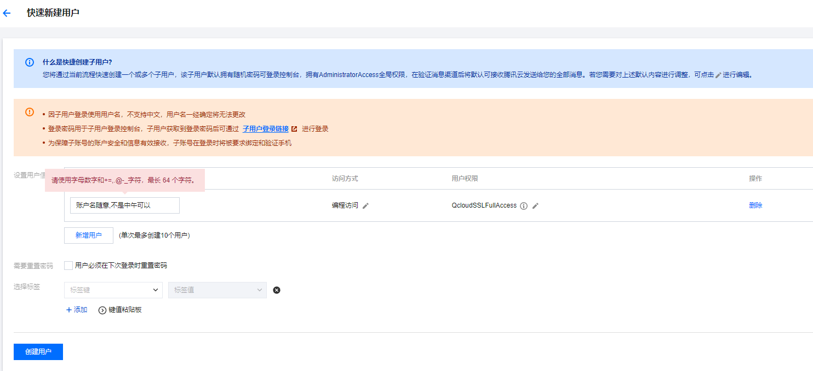

# 自动部署腾讯云的免费证书

----

## 一.使用环境说明

1. Nginx使用Docker部署
2. SSL证书是存放在服务器某个目录上,上传证书后重启Nginx容器即可完成更换证书
3. 需提前新建好存放证书的目录
4. 证书名称和域名是一样的
5. 域名在腾讯云上
6. 证书也是用的腾讯云的证书(经测试了免费证书)

## 二.使用步骤:

### 0.fork仓库到自己的名下

### 1.腾讯云创建一个专门用于管理SSL证书的子账号,并获取secret_id和secret_key



```text
注意访问方式和访问权限,点击创建用户后即可拿到secret_id和secret_key
secret_id和secret_key只是在创建的时候可以看到,记得保存好
```

### 2.在fork的仓库中添加环境变量

Fork 本仓库后, 在你自己的仓库中,
进入 ```Settings - Secrets and variables - Actions```,
添加环境变量作为 ```Repository secrets```.

| 变量名称                   | 值类型    | 示例                 | 说明                    |
|------------------------|--------|--------------------|-----------------------|
| DOMAIN                 | String | xxx.com            | 要部署的域名                |
| TENCENT_SECRET_ID      | String | xxxxxx             | 第一步申请的secret_id       |
| TENCENT_SECRET_KEY     | String | xxxxxx             | 第一步申请的secret_key      |
| UPLOAD_PATH_PREFIX     | String | /docker/Nginx/ssl/ | 证书文件存放路径的前缀,结尾要带斜杠    |
| SERVICE_HOSTNAME       | String | 1.1.1.1            | 服务器地址                 |
| SERVICE_PORT           | int    | 22                 | 服务器端口                 |
| SERVICE_USERNAME       | String | root               | 服务器登录用户名              |
| SERVICE_PASSWORD       | String | root               | 服务器登录密码               |
| DEPLOY_NGINX_CONTAINER | String | ca3b2c92de11       | Nginx容器的ID或者名称,用来重启容器 |
| COUNTDOWN              | int    | 1                  | 剩余时间多少天内进行重新申请和部署     |

### 3.修改python-script.yml文件,符合自己需求的检查时间

修改下.github/workflows/python-script.yml文件中的内容

把文件中on的这一部分修改为每天午夜12点执行一次

也可以修改cron表达式符合你需要的更新频率

```yaml
on:
  schedule:
    - cron: '0 0 * * *'
```
